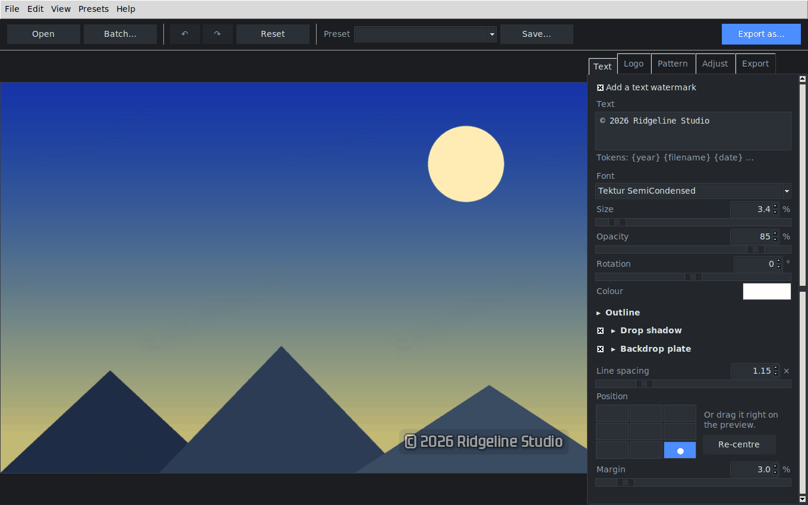

# WaterMark

Watermark, resize and compress your photos — one at a time, or a whole folder at
once. Everything runs locally; no image ever leaves your computer.



*Every screen is captured in [docs/SCREENS.md](docs/SCREENS.md).*

---

## What it does

**Watermarking**

- **Text watermarks** with your choice of font, size, colour, opacity, rotation,
  outline, drop shadow and a rounded backdrop plate for busy photos.
- **Logo watermarks** from any PNG/WebP, with scale, opacity, rotation and an
  optional greyscale conversion.
- **Tiled patterns** — a repeating diagonal wash across the whole image, built
  from either the text or the logo. Far harder to crop out than a corner stamp.
- **Placement** on a nine-point grid with a percentage margin, or just **drag the
  watermark around on the preview**.
- **Text tokens** — `{year}`, `{filename}`, `{date}`, `{width}` and friends are
  filled in per image, so one setting covers a whole shoot.

**Framing**

- **Crop** by dragging a rectangle on the preview, with thirds guides and a live
  pixel readout. Flips and rotation are applied first, so you can straighten a
  photo and then trim the empty corners off.
- **Compare** against the un-watermarked image at any time — toggle it in the
  toolbar, or hold `\` for a quick peek.

**Compression and export**

- Convert between **PNG, JPEG, WebP, AVIF and TIFF** (whichever your Pillow build
  supports — the app only offers formats it can actually write).
- **Quality control** per format, plus progressive JPEG, chroma subsampling,
  PNG compression effort and **PNG palette quantization** (60–80% smaller for
  screenshots and flat graphics).
- **Fit under a file size** — say "500 KB" and the app lowers quality, then
  dimensions if it must, until the file fits. Useful for upload limits.
- **Resize on export**: fit within a maximum, scale by percentage, or crop to an
  exact size.
- A **live size estimate** in the status bar, before you export anything.

**Privacy**

- **EXIF, GPS and camera data are stripped by default.** Colour profiles are
  kept unless you say otherwise.

**Batch**

- Point it at files or folders (optionally recursive), pick an output folder and
  a filename pattern, and process everything in parallel with a progress bar and
  a working cancel button.
- Conflict policy: rename, overwrite or skip. Writing over your **originals is
  never the default** — a result that would land on its source is renamed.
- One bad file reports its error and the run continues.

**Everyday niceties**

- Live preview that updates as you type, rendered off the UI thread.
- Nine **built-in presets** — Signature, Copyright bar, Confidential (tiled),
  Draft proof, Logo corner, Web ready, Email friendly (500 KB), Social square,
  Privacy scrub — plus your own saved presets.
- Undo/redo, recent files, keyboard shortcuts, dark and light themes, zoom and
  pan, and settings that survive a restart.
- Drag and drop when `tkinterdnd2` is installed, file dialogs when it is not.

---

## Install

```bash
git clone https://github.com/rajrishi-06/watermark.git
cd watermark
pip install .              # add [dnd] for drag-and-drop: pip install ".[dnd]"
```

Tkinter ships with the python.org installers on Windows and macOS. On Debian or
Ubuntu you may need it separately:

```bash
sudo apt install python3-tk
```

Then launch the app:

```bash
watermark-gui          # installed entry point
python -m watermark    # from a checkout
python watermark_app.py  # the original entry point still works
```

---

## Command line

Every feature is scriptable, so the app fits into build steps and cron jobs.

```bash
# Watermark one image
watermark apply photo.jpg -o out.jpg --text "© {year} Me" --anchor bottom-right --shadow

# Watermark a whole tree with a preset
watermark batch ~/Photos -o ~/Watermarked --recursive --preset "Signature"

# Tiled "CONFIDENTIAL" wash, converted to WebP
watermark batch ./contracts -o ./sent --preset "Confidential — tiled" --format webp

# Shrink without watermarking, until each file fits 300 KB
watermark compress ./exports -o ./small --format webp --target-size 300k

# Trim 10% off the left and right, straighten, then shrink
watermark compress ./scans -o ./trimmed --crop 10,0,10,0 --rotate 1.5 --max-dimension 2000

# Inspect files
watermark info photo.jpg --json

# List presets
watermark presets
```

`watermark <command> --help` lists every option. `batch` refuses to write beside
your originals unless you pass `--in-place`, and `--dry-run` does all the work
without writing anything.

---

## Text and filename tokens

Usable in watermark text and in batch filename patterns:

| Token | Becomes |
| --- | --- |
| `{filename}` | `photo.jpg` |
| `{name}` / `{ext}` | `photo` / `.jpg` |
| `{width}` / `{height}` | pixel dimensions after transforms |
| `{date}` / `{time}` / `{datetime}` | `2026-08-19` / `14-05-32` / both |
| `{year}` | `2026` |
| `{index}` / `{count}` | position in a batch run / total |

Unknown tokens are left alone, so a watermark reading `{Draft}` stays `{Draft}`.

---

## Where your files live

| What | Location |
| --- | --- |
| Settings | `%APPDATA%\WaterMark\config` · `~/Library/Application Support/WaterMark` · `~/.config/watermark` |
| Presets | the matching data directory, as one JSON file each |
| Logs | rotating `watermark.log` in the platform log directory |

Preferences → *Where files are kept* opens any of them. Setting
`WATERMARK_CONFIG_DIR`, `WATERMARK_DATA_DIR` or `WATERMARK_LOG_DIR` overrides
them, which is handy for a portable install.

---

## Project layout

The image logic is deliberately separate from the interface: `watermark.core`
never imports Tkinter, which is what lets the CLI, the batch runner and the test
suite drive it on a headless machine.

```
watermark/
├── core/            # no GUI dependency
│   ├── models.py    # serializable settings (a preset is this, as JSON)
│   ├── imageio.py   # safe loading: EXIF orientation, size guard, typed errors
│   ├── render.py    # the watermark pipeline (text / logo / tiled layers)
│   ├── export.py    # encoding, compression, target-size search
│   ├── batch.py     # parallel batch runner with progress and cancellation
│   ├── transforms.py, fonts.py, tokens.py, presets.py, config.py, …
├── ui/              # Tkinter desktop app
│   ├── app.py       # the window, settings binding, undo/redo
│   ├── preview.py   # live canvas: checkerboard, zoom, drag-to-position
│   ├── engine.py    # off-thread rendering with request coalescing
│   ├── widgets.py, dialogs.py, theme.py, dnd.py
└── cli.py           # headless interface
```

Because every dimension in the settings is a **percentage of the image**, a
preset looks identical on a 600px preview and a 6000px original — which is also
how the live preview stays fast without lying about the result.

---

## Development

```bash
pip install -e ".[dev]"
pytest                    # GUI tests skip when there is no display
xvfb-run -a pytest        # …or run them on a headless box
```

The suite covers the settings model, placement maths, rendering, every
compression path, the batch runner's naming and conflict rules, presets, the
CLI, and a real Tk window driven end to end.
