# Screens

Every screen, captured from the running application. Each was driven
programmatically and asserted on — see `tests/test_ui.py` for the checks that
keep them honest.

## Text tab — sections expanded
Font, size, colour, opacity and rotation, with Outline, Drop shadow and
Backdrop plate open. Tokens in the text box are expanded live in the preview.

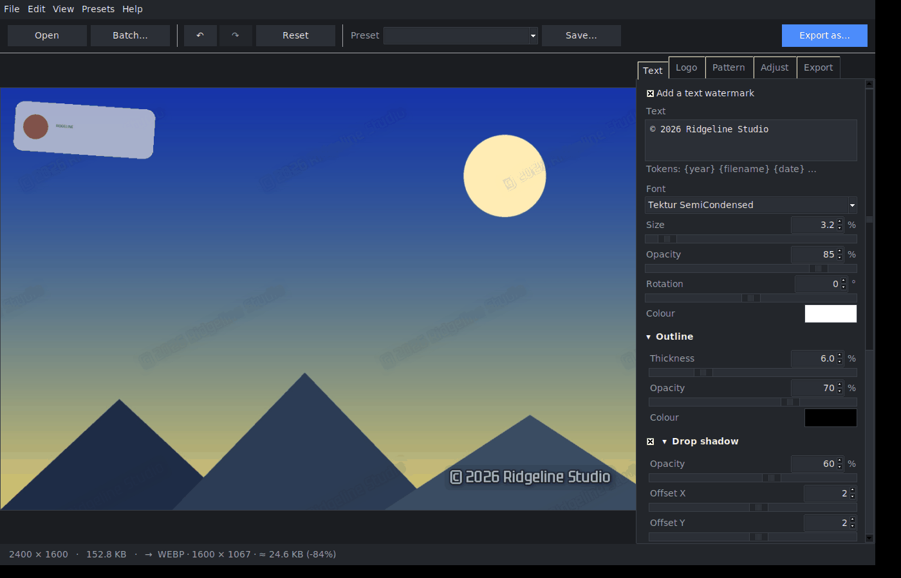

## Logo tab
Scale, opacity, rotation and greyscale for an image watermark, with the
nine-point position pad.

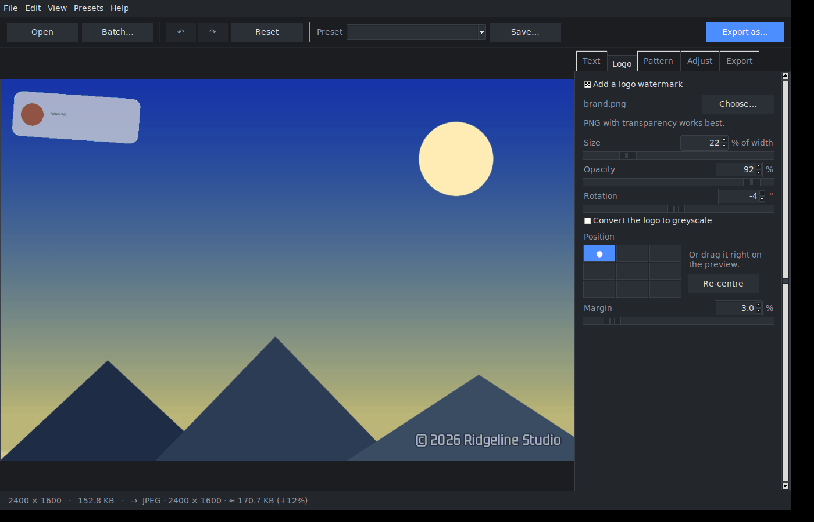

## Pattern tab
The repeating wash, built from either the text or the logo, with angle,
spacing, opacity and row stagger.

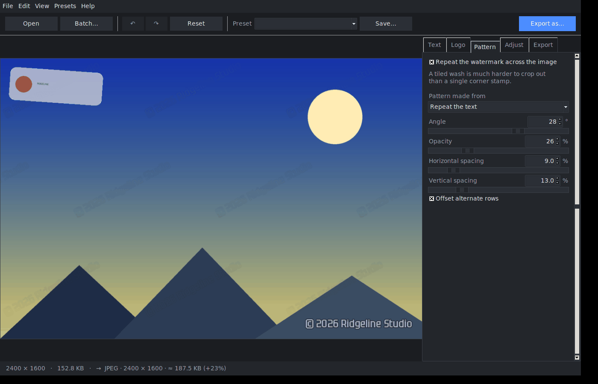

## Adjust tab
Rotation and flips are applied *before* the watermark, so the watermark always
stays the right way up — visible here on a 90°-rotated, flipped frame.

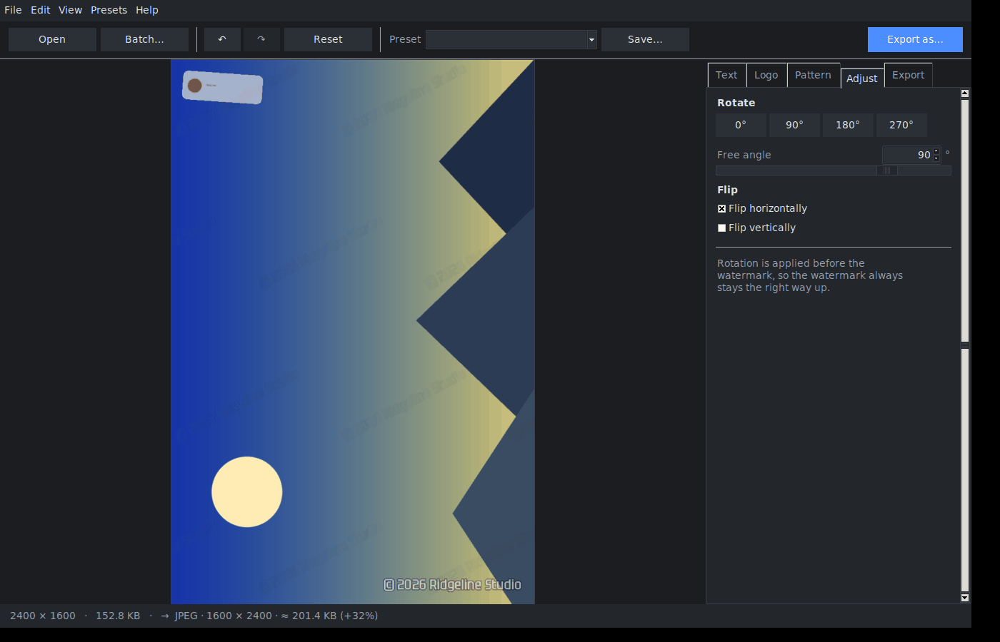

## Export tab
Format, quality, resize and the "fit under a file size" budget. Controls that
do not apply to the current format or resize mode are greyed out.

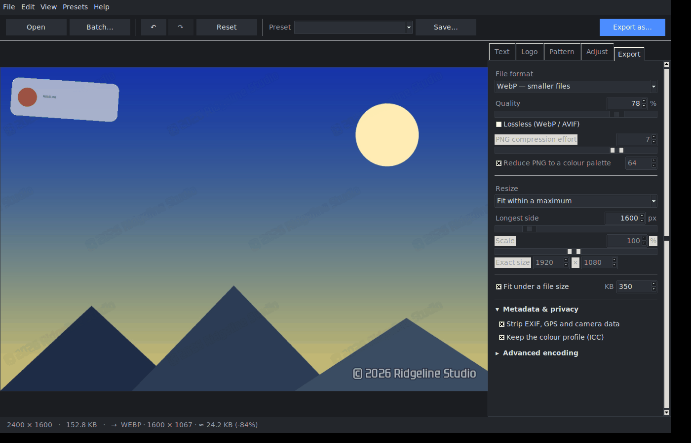

## Presets
Nine built-ins plus anything you save.

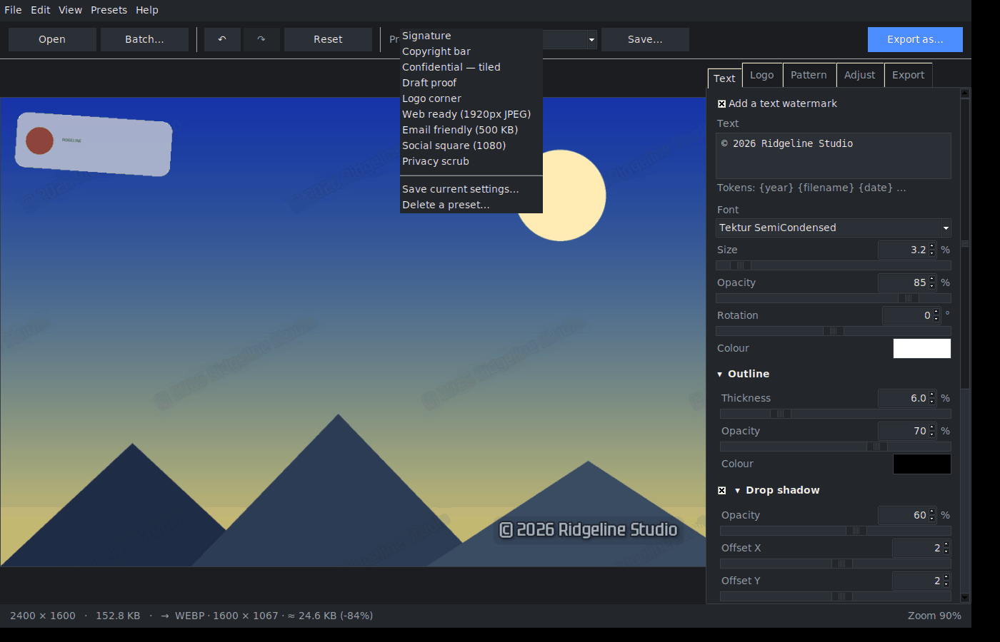

## Saving a preset
Built-in names are refused inline rather than after the fact.

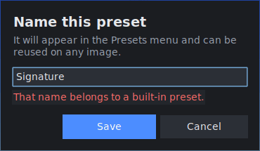

## Batch
Files or folders in, an output folder and a name pattern out, with live
progress and a summary of what it saved.

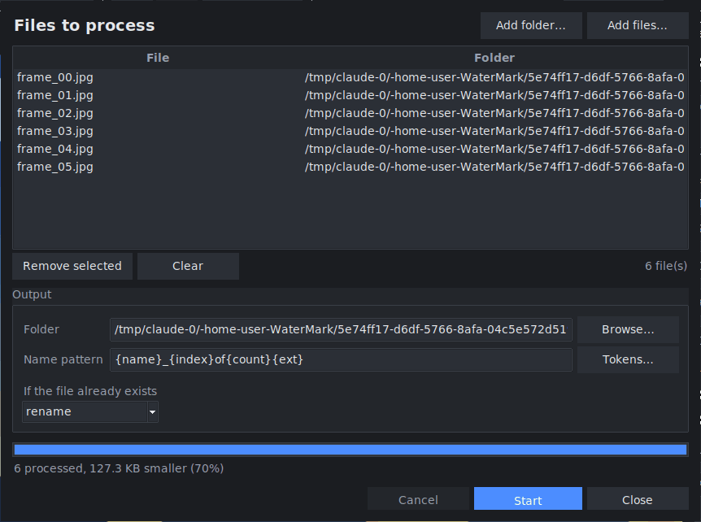

## Preferences
Theme, preview quality, worker count — and a shortcut to wherever your
settings, presets and logs actually live.

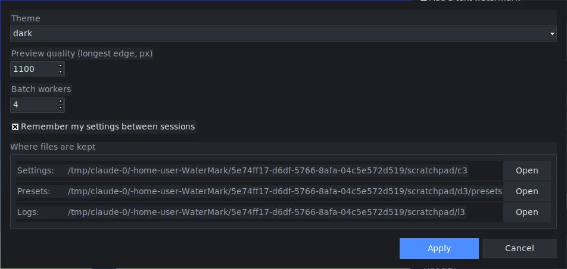

## Light theme
The whole window rebuilds; your image, settings and history survive.

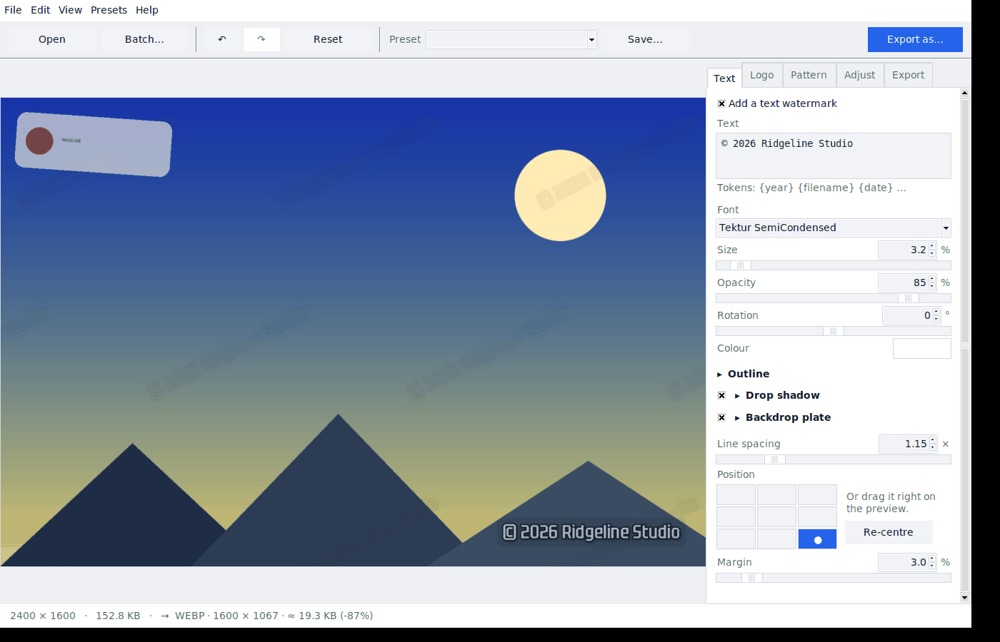

## Help

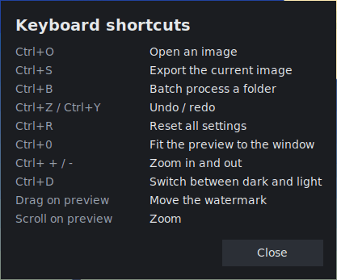

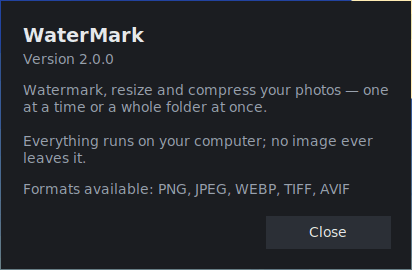
